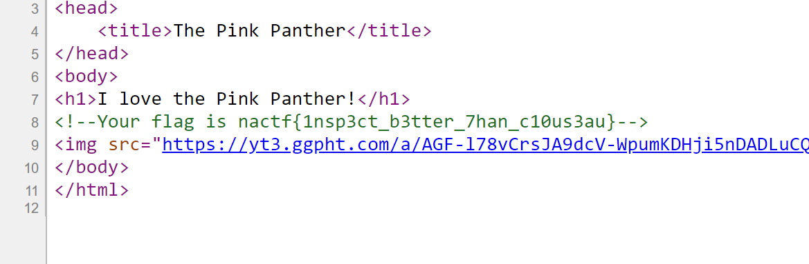
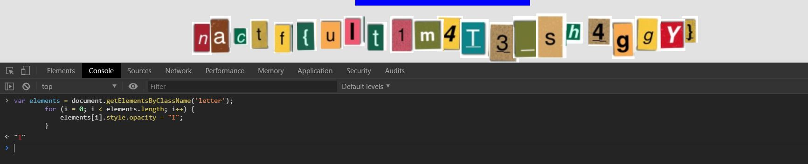
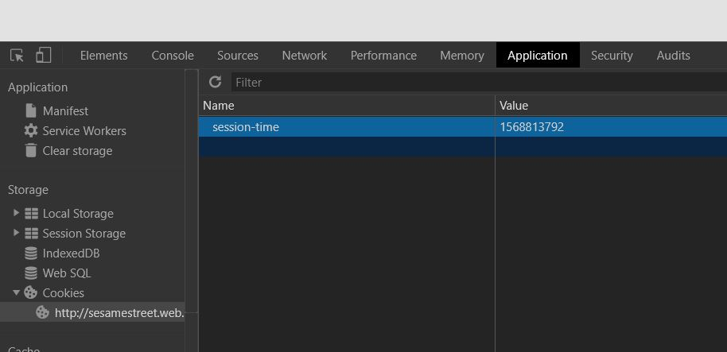
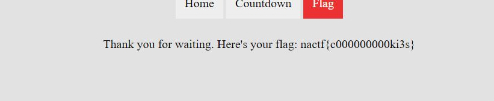

 # [nactf.com] Whiteup Web Exploitation Challenges
 
 Oke, mình đã quay trở lại rồi đây =))) mình thấy mấy challages này khá là hay. <br/>
 
 Không dài dòng nữa bắt đầu thôi =))) <br/>
 
 ## Pink Panther 
 
 I love the Pink Panther! :> bạn có xem phim này không =)))) <br>
 
 đọc Solve đã biết chúng ta sẽ phải Inspect rồi đúng không, okey Ctr + U 
 
  <br>
 
 flag là: `nactf{1nsp3ct_b3tter_7han_c10us3au}` <br>
 
 ## Scooby Doo 
 
 Nhìn thấy các bạn chọn thẻ Game rồi đúng hem :> vào game bạn sẽ thấy bạn sẽ phải click bào cái button 1 triệu cái nó mới hiện flag cho bạn <br>
 
 Mà flag thì lại ở dưới nó chỉ bị làm mờ đi mà thôi, trong css có thuộc tính `opacity` nó là mờ đối tượng, v ta chỉ cần cho nó hiện lên bạn chỉ cần để `opacity` bằng 1 là xong. <br>
  <br>
Okey flag thu được: `nactf{ult1m4T3_sh4ggY}`

## Dexter's Lab

Link: [http://dexterslab.web.2019.nactf.com/](http://dexterslab.web.2019.nactf.com/) <br>

Okey đọc solve thấy chúng ta sẽ dùng kiểu tấn công SQL Injection ròi :v <br>

Câu Query mà chúng ta sẽ dùng là: <br>
> SELECT * FROM USERS WHERE username = 'admin' AND password = '' or ' x '= ' x <br>

Thu được CTF ngay: <br>

<br>
Flag: `nactf{1nj3c7ion5_ar3_saf3_in_th3_l4b}`

## Sesame Street

Link: [http://sesamestreet.web.2019.nactf.com/](http://sesamestreet.web.2019.nactf.com/) <br>

Có vẻ như chúng ta sẽ làm gì đó với cookie :3 <br>

Click vào Flag bạn sẽ thấy yêu cầu không tìm thấy cookies, chắc chúng ta sẽ thêm cookie cho trang homepage <br>

Hmm, ta xem cookie của trang countdown sẽ thấy: <br>

Set cookies cho trang homepage bạn nhấn Ctrl Shift I r paste: <br>
```javascript
document.cookie="session-time=1568813792"
```
Oke click vào flag ta thấy có vẻ như timestamp của cookie phải lớn hơn cái timestamp của ngày 22 tháng 9 năm 2019
```javascript
document.cookie="session-time=15688137929"
```
Thêm số 9 vào sau là đã lớn hơn rất nhiều rồi =)))) <br>
Okey <br>

Here's your flag: `nactf{c000000000ki3s}`

 
